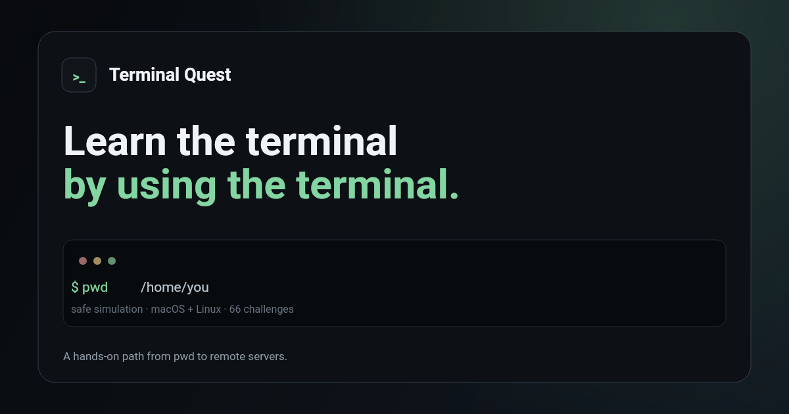

# Terminal Quest

[](https://github.com/brunozapico/terminal-game/actions/workflows/test.yml)

**Terminal Quest** is a browser-based learning game for building practical macOS and Linux terminal skills. Players learn by doing: each mission presents a small, realistic scenario and is completed by running commands in a safe, simulated terminal.

The project is designed to make experimentation approachable. You can inspect files, navigate directories, work with text, pipes, permissions, processes, archives, networking, and simulated remote hosts—without ever touching your computer's actual filesystem or shell.



## What you can learn

- 66 progressive challenges across 18 levels, from `pwd` and `ls` to pipes, permissions, processes, archives, SSH, and a final server mission.
- A guided Learn mode with contextual explanations, examples, hints, objectives, XP, streaks, and progress navigation.
- A disposable Practice mode for trying commands freely.
- A searchable command library with examples and platform notes.
- Scenarios covering both macOS and Linux differences, plus fictional remote machines for SSH and `scp` exercises.
- Local progress persistence in the browser, with no account required.

## Safety model

Terminal Quest is a simulator, not a terminal emulator connected to your machine. Commands operate on an in-memory virtual filesystem and fictional processes; simulated network commands do not make real network requests. Practice data is disposable, and the app does not need a backend.

It intentionally models a practical subset of shell behavior rather than every edge case of Bash or Zsh. Use it to build intuition, then consult your platform's documentation before running unfamiliar commands on real files or servers.

## How it is built

The application is deliberately compact and dependency-free at runtime:

- `index.html` contains the responsive UI, styling, game state, virtual filesystem, shell parser, command implementations, and challenge definitions.
- Commands are registered in one command catalog, which powers both the terminal and the command library.
- Challenges define a setup scenario and validate the resulting virtual state, rather than requiring one exact command sequence whenever possible.
- Browser `localStorage` saves the player name, unlocked challenges, XP, streak, and hint usage locally.
- A Node.js regression suite drives the rendered interface and completes all 66 challenges.

## Stack

- Vanilla HTML, CSS, and JavaScript
- Node.js built-in test runner
- [happy-dom](https://github.com/capricorn86/happy-dom) for browser-like automated tests
- GitHub Actions for continuous integration

## Run locally

No build step, server, or runtime dependency is required to use the app. Open `index.html` in a modern browser.

For local development, serving the directory through a simple static server is also fine. For example:

```bash
npx serve .
```

## Test

Install the development dependency and run the test suite:

```bash
npm ci
npm test
```

The suite verifies the onboarding flow, UI structure and social metadata, challenge navigation, and end-to-end completion of every challenge. Tests also run on every push and pull request through GitHub Actions.

## Extend the game

### Add a command

In the inline script in `index.html`, add a command through `registerCommand("name", { ... })`. Definitions can include metadata for the library and an `execute(args, ctx)` handler that returns terminal output.

### Add a challenge

Add a `makeChallenge({ ... })` entry to `challengeList`. Each challenge supplies a scenario and a validator, so successful solutions are checked against the virtual filesystem or environment state instead of only matching typed text.

When you add or change a challenge, update the regression suite as needed and run `npm test`.

## Project structure

```text
.
├── index.html                  # Entire static application
├── test/terminal-quest.test.js # End-to-end regression suite
├── .github/workflows/test.yml  # CI workflow
├── og-image.svg                # Editable social-card source
├── og-image.png                # Social preview image
└── package.json                # Test tooling only
```

## Deployment

Terminal Quest can be deployed to any static host. There is no build command or server-side configuration required. The app is also ready to deploy to Vercel: import the repository and use `./` as the root directory.

## License

This project is released under the [MIT License](LICENSE).
